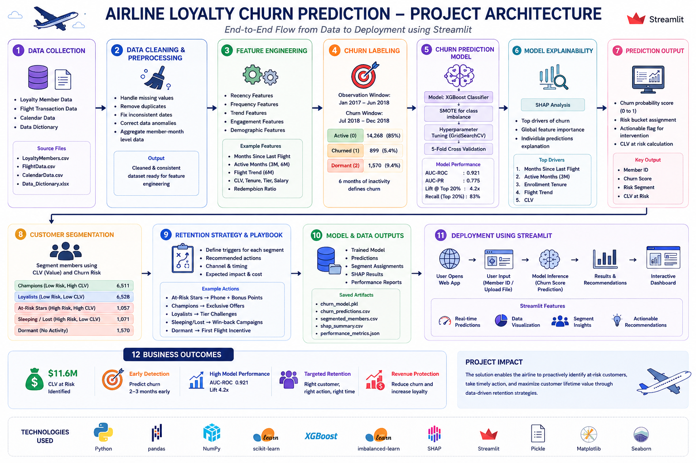

# ✈️ Behavioural Intelligence in Airline Loyalty Programmes

A Business Analytics project focused on predicting customer churn, identifying high-value at-risk loyalty members, and designing data-driven retention strategies for an airline loyalty program.

## 📌 Project Overview

Traditional airline loyalty programs rely heavily on historical metrics such as points balance and membership tier. These indicators often fail to identify customers who are gradually disengaging before they stop flying altogether.

This project uses machine learning, customer segmentation, and behavioral analytics to:

* Predict customer churn before it occurs
* Identify high-value customers at risk of leaving
* Segment members based on Customer Lifetime Value (CLV) and churn probability
* Design targeted retention campaigns
* Generate actionable business recommendations for marketing and loyalty teams

---

## 🎯 Business Objectives

* Detect churn 2–3 months before customers become inactive
* Quantify customer lifetime value at risk
* Improve retention campaign efficiency
* Convert dormant loyalty members into active flyers
* Provide decision-makers with actionable insights

---

## 📊 Dataset Summary

| Metric          | Value     |
| --------------- | --------- |
| Loyalty Members | 16,737    |
| Flight Records  | 392,936   |
| Data Period     | 2017–2018 |
| Churned Members | 899       |
| Dormant Members | 1,570     |

---

## 🧹 Data Cleaning & Preprocessing

Major cleaning steps included:

* Handling 25% missing salary values using median imputation
* Removing 1,922 duplicate flight records
* Correcting enrollment date inconsistencies
* Detecting CLV–activity mismatches
* Aggregating duplicate member-month records
* Auditing anomalies across multiple dimensions

---

## ⚙️ Feature Engineering

Features were created across five categories:

### Recency

* Months since last flight

### Frequency

* Flights over 3, 6, 12, and 18-month periods

### Trend

* Recent flight activity changes

### Engagement

* Redemption ratios
* Seasonal flying behavior

### Demographics

* CLV
* Card tier
* Salary
* Education
* Marital status
* Enrollment tenure

---

## 🤖 Churn Prediction Model

### Model Used

* XGBoost Classifier

### Class Imbalance Handling

* SMOTE Oversampling
* Class Weight Adjustment

### Model Performance

| Metric         | Score |
| -------------- | ----- |
| AUC-ROC        | 0.921 |
| AUC-PR         | 0.775 |
| Lift @ Top 20% | 4.2×  |
| Recall         | 79%   |

### Key Insight

Customer inactivity is the strongest churn indicator.

* 3 months inactive → Early warning stage
* 6 months inactive → 93.5% churn probability

---

## 🔍 Model Explainability (SHAP)

Top churn drivers:

1. Months Since Last Flight
2. Active Months (Last 3 Months)
3. Enrollment Tenure
4. Flight Trend
5. Customer Lifetime Value (CLV)

---

## 👥 Customer Segmentation

Members were segmented using CLV and Churn Risk.

| Segment       | Members | Avg CLV | Strategic Action        |
| ------------- | ------- | ------- | ----------------------- |
| Champions     | 6,511   | $12,164 | Protect & Reward        |
| Loyalists     | 6,528   | $3,895  | Grow Value              |
| At-Risk Stars | 1,057   | $10,952 | Immediate Intervention  |
| Sleeping/Lost | 1,071   | $4,095  | Low-Cost Re-engagement  |
| Dormant       | 1,570   | $8,361  | First-Flight Activation |

---

## 💰 Business Impact

### CLV at Risk

* **$11.6 Million** in customer lifetime value identified as being at risk.

### At-Risk Stars

* 1,057 high-value customers likely to churn within 90 days.

### Dormant Opportunity

* 1,570 members never flew but maintain high CLV through partner programs and credit card activity.

---

## 📈 Retention Strategy

### At-Risk Stars

* Personal outreach
* Status matching
* Double points campaigns

### Champions

* Exclusive route offers
* Early access promotions

### Loyalists

* Tier-upgrade challenges
* Value growth campaigns

### Sleeping/Lost

* Win-back discounts
* Personalized route promotions

### Dormant Members

* First-flight activation emails
* Double points incentives
* Booking fee waivers

---

## 🏗️ Project Architecture

```text
Data Collection
        │
        ▼
Data Cleaning & Auditing
        │
        ▼
Feature Engineering
        │
        ▼
XGBoost Churn Model
        │
        ▼
SHAP Explainability
        │
        ▼
Customer Segmentation
        │
        ▼
Retention Strategy Design
        │
        ▼
Interactive Dashboard
```

## 🛠️ Tech Stack

* Python
* Pandas
* NumPy
* Scikit-Learn
* XGBoost
* SMOTE
* SHAP
* Plotly
* Streamlit

---

## 📂 Project Structure

```text
AirLine_SummerProject_IITGUWAHATI/
│
├── Datasets/
│   ├── LoyaltyMembers.csv
│   ├── FlightData.csv
│   ├── CalendarData.csv
│   └── Data_Dictionary.xlsx
│
├── pipeline/
│   │
│   ├── outputs/
│   │   ├── churn_predictions.csv
│   │   ├── segmented_members.csv
│   │   ├── shap_feature_importance.csv
│   │   ├── anomaly_report.csv
│   │   ├── cleaning_decisions_log.csv
│   │   └── churn_model.json
│   │
│   ├── phase1_eda_cleaning.py
│   ├── phase2_feature_engineering.py
│   ├── phase3_churn_model.py
│   ├── phase4_segmentation.py
│   └── phase5_dashboard.py
│
├── requirements.txt
├── README.md

```


---

## 🚀 Running the Dashboard

```bash
streamlit run phase5_dashboard.py
```

---

---

## 🔗 Project Links

### GitHub Repository

https://github.com/Shaik-NowshinFarhana/AirLine_SummerProject_IITGUWAHATI

### Live Dashboard

https://airline-loyalty-summerprojectiitguwahati-xmus8g5se5zrcpidyxsgq.streamlit.app/

---


---

## 📜 Key Takeaways

* Churn can be predicted 2–3 months before customer disengagement.
* Customer inactivity is the strongest predictor of churn.
* $11.6M in loyalty value is at immediate risk.
* Dormant members represent a significant untapped revenue opportunity.
* Predictive analytics can transform loyalty programs from reactive to proactive customer engagement systems.

---

### ⭐ If you found this project useful, consider giving the repository a star!
